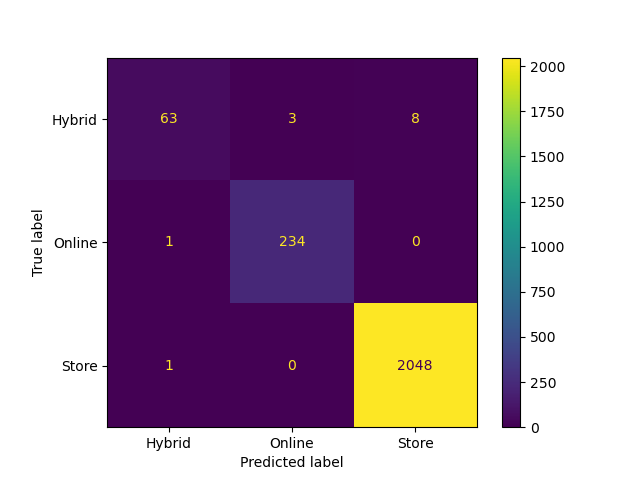

# Consumer-Shopping-Trends-Analysis
This repository focuses on understanding the shopping tends between customer and their decisions. Additionally, an ML model is built to predict whether consumers prefer to buy online or in a physical store.

By visualizing the results, we can see how the model distinguishes between labels:

