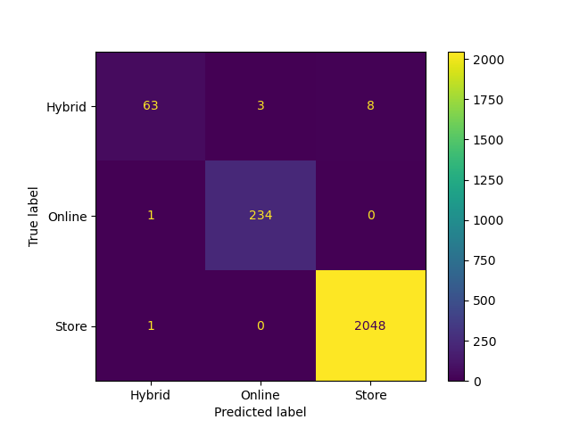

# 🛍️ Consumer Shopping Trends Prediction API

---

## 📌 Overview

This project is a Machine Learning system designed to predict customer shopping preferences (Online, Store, Hybrid) based on behavioral and demographic data.

It includes:

* A trained XGBoost classification model
* A fully functional FastAPI REST API
* A Dockerized deployment for easy execution anywhere

---

## 🚀 Features

* End-to-end ML pipeline (data → model → API)
* Real-time predictions via REST API
* Docker container for reproducibility
* Structured and production-ready code

---

## 🧠 Model Details

The model is trained using:

* XGBoost Classifier
* Stratified sampling to handle class imbalance
* Hyperparameter tuning focused on:

  * `min_child_weight`
  * `max_delta_step`

### ⚠️ Challenges

* Imbalanced dataset (Hybrid class underrepresented)
* Risk of overfitting mitigated through conservative tuning

---

## 📊 Evaluation



### Performance Metrics

| Class  | Precision | Recall | F1-Score | Support |
| ------ | --------- | ------ | -------- | ------- |
| Hybrid | 0.97      | 0.85   | **0.91** | 74      |
| Online | 0.99      | 1.00   | **0.99** | 235     |
| Store  | 1.00      | 1.00   | **1.00** | 2049    |

**Overall Metrics:**

* **Accuracy**: **99%**
* **Macro Average F1**: **0.97**
* **Weighted Average F1**: **0.99**

The model achieves excellent overall performance, with near-perfect results on the `Store` and `Online` classes. The `Hybrid` class, being the most underrepresented, shows a lower recall (0.85), which is the main area for future improvement.

---

## 🧩 API Usage

### Endpoint

```bash
POST /predict
```

### Example Request

```json
{
  "age": 30,
  "monthly_income": 50000,
  "daily_internet_hours": 5,
  "smartphone_usage_years": 4,
  "social_media_hours": 2.5,
  "online_payment_trust_score": 8,
  "tech_savvy_score": 7,
  "monthly_online_orders": 10,
  "monthly_store_visits": 3,
  "avg_online_spend": 150,
  "avg_store_spend": 80,
  "discount_sensitivity": 5,
  "return_frequency": 2,
  "avg_delivery_days": 3,
  "delivery_fee_sensitivity": 7,
  "free_return_importance": 9,
  "product_availability_online": 8,
  "impulse_buying_score": 6,
  "need_touch_feel_score": 4,
  "brand_loyalty_score": 7,
  "environmental_awareness": 8,
  "time_pressure_level": 5,
  "gender": "Female",
  "city_tier": "Tier 1"
}
```

### Example Response

```json
{
  "prediction": "Online"
}
```

---

## 🐳 Run with Docker

### 1. Build the image

```bash
docker build -t shopping-api .
```

### 2. Run the container

```bash
docker run -p 8000:8000 shopping-api
```

### 3. Open API docs

```bash
http://localhost:8000/docs
```

---

## ☁️ Run from Docker Hub


```bash
docker pull juan23belmonte/shopping-api
docker run -p 8000:8000 juan23belmonte/shopping-api
```

---

## 📁 Project Structure

```bash
.
├── data/          # Trained model and encoders
├── src/           # FastAPI application
├── visuals/       # Evaluation plots
├── Dockerfile
├── requirements.txt
└── README.md
```

---

## 🔮 Future Improvements

* Add multiple models and comparison
* Integrate MLflow for experiment tracking
* Improve handling of class imbalance
* Deploy to cloud (AWS / GCP)

---

## 🧑💻 Author

[Juan Belmonte González](https://www.linkedin.com/in/juan-belmonte-gonzález-1809ab368)

